# 🤖 Friend

> *"if not friend, why friend shaped?"*

**Friend** is a command and control (C2) framework that believes in the power of friendship... and remote system administration. Just because it can execute arbitrary commands across distributed systems doesn't mean it can't be adorable while doing it.

## 🌟 Philosophy

Friend operates on a simple principle: everything looks friendlier when it's designed with care. Our C2 framework may have the capability to orchestrate complex distributed operations, but at its heart, it's just trying to help friends stay connected across networks.

The question isn't *"Should I trust this system with my infrastructure?"* 

The question is *"If not friend, why friend shaped?"*

## 🏗️ Architecture

Friend consists of three main components that work together in perfect harmony, like good friends should:

```mermaid
graph LR
    GUI["<b>GUI</b><br/>• Textual TUI<br/>• Task mgmt<br/>• Real-time monitoring"] 
    CMD["<b>C2<br/></b>• REST API<br/>• Task queue<br/>• Connection tracking"]
    BCN["<b>Beacon<br/></b> • Heartbeat<br/>• Cmd exec<br/>• Result reporting"]
    
    GUI <--> CMD
    CMD <--> BCN
```



### 🏠 Command Server (`command/`)
*The friendly neighborhood coordinator*

The Command Server is the heart of Friend - a FastAPI-based REST service that manages all your beacon friends. It's like a really good friend who always remembers everyone's birthdays and keeps track of who owes who money.

**Key Features:**
- **Connection Management**: Tracks active beacon connections with heartbeat monitoring
- **Task Distribution**: Queues and distributes commands to registered beacons
- **Real-time Status**: Provides live status updates on all connections and tasks
- **RESTful API**: Clean HTTP endpoints for all operations

**API Endpoints:**
```
GET  /register              - Register a new beacon friend
GET  /heartbeat/{id}         - Beacon check-in and task retrieval  
POST /update_task/{id}       - Submit task results
POST /add_task/{id}          - Queue new task for beacon
GET  /status                 - View all connections and tasks
```

**Communication Flow:**


### 📡 Beacon Client (`beacon/`)
*The helpful friend who does what you ask*

Written in C for maximum compatibility and minimal footprint, the Beacon is your reliable friend on remote systems. It's like that friend who always answers when you call and never complains about helping you move.

**Key Features:**
- **Persistent Connection**: Maintains connection to command server via heartbeat
- **Command Execution**: Executes shell commands using `popen()` with full output capture
- **JSON Communication**: Structured communication protocol with the command server
- **Automatic Reconnection**: Resilient connection handling
- **Cross-platform**: Runs on any system with libcurl and cjson

**Dependencies:**
- `libcurl` - HTTP communication with command server
- `cjson` - JSON parsing and generation

### 🖥️ GUI (`gui/`)
*The friendly face you interact with*

A beautiful Textual-based TUI that makes managing your beacon friends a joy. It's like having a really well-organized friend who color-codes everything and always knows what's happening.

**Key Features:**
- **Live Connection Monitoring**: Real-time view of all beacon friends
- **Interactive Task Management**: Send commands and view results instantly
- **Full Output Viewing**: Click any task to see complete output in a modal
- **Status Indicators**: Visual status indicators (🟢 Online, 🟡 Stale, 🔴 Offline)
- **Keyboard Shortcuts**: Efficient navigation and control

## 🚀 Quick Start

### One-Command Demo

The fastest way to see Friend in action:

```bash
cd /path/to/friend
./demo.sh
```

This magical script will:
1. 🔨 Build the beacon client
2. 🌐 Start the command server  
3. 📡 Launch a beacon instance
4. 🖥️ Open the GUI for interaction
5. 🧹 Clean up everything when you're done

### Manual Setup

If you prefer the scenic route:

#### 1. Start the Command Server
```bash
cd command
uv run app.py
```
*Server will be available at http://localhost:8000*

#### 2. Build and Run Beacon
```bash
cd beacon
cmake -B build
cmake --build build
./build/beacon
```

#### 3. Launch the GUI
```bash
cd gui  
python main.py
```

## 🎮 Usage Guide

### Using the GUI

Once Friend's GUI is running, you'll see a friendly interface with:

#### Connections Tab
- **Connections Panel**: Shows all your beacon friends with status indicators
- **Tasks Panel**: Displays tasks for the selected connection
- **Command Input**: Type commands to send to your selected beacon friend

#### Interacting with Beacon Friends

1. **Select a Connection**: Click on any beacon in the connections table
2. **Send Commands**: Type in the command input box and press Enter
3. **View Results**: Click on any task row to see full output
4. **Monitor Status**: Watch real-time status updates

#### Keyboard Shortcuts
- `r` - Refresh all data
- `c` - Clear log messages  
- `q` - Quit the application
- `t` - Send test command to first available beacon

### Command Examples

Try these friendly commands with your beacon friends:

```bash
# System information
whoami
uname -a
uptime

# File operations  
ls -la
pwd
cat /etc/hostname

# Process monitoring
ps aux
top -n 1

# Network information
ifconfig
netstat -tuln
```

## 🔧 Development

### Project Structure


### Building Components

#### Beacon Client (C)
```bash
cd beacon
cmake -B build
cmake --build build
```

*Requirements: CMake, libcurl-dev, libcjson-dev*

#### Python Components  
```bash
# Command server
cd command
uv sync
uv run app.py

# GUI application
cd gui  
uv sync
python main.py
```

*Requirements: Python 3.8+, uv package manager*

### Technical Implementation Details

#### Communication Protocol

Friend uses a custom string-based protocol for task communication:

```
Format: uid=UUID('...') command='...'
Example: uid=UUID('123e4567-e89b-12d3-a456-426614174000') command='ls -la'
```

#### Task Status Codes
```python
from enum import Enum

class TaskStatus(Enum):
    ERROR = -1      # ❌ Task failed
    COMPLETE = 0    # ✅ Task completed successfully  
    PENDING = 2     # ⏳ Task queued/in progress
```

#### Connection Management

Beacons maintain connection through:
- **Registration**: Initial UUID assignment via `/register`
- **Heartbeat**: Periodic check-ins via `/heartbeat/{id}` (retrieves pending tasks)
- **Result Submission**: Task completion via `/update_task/{id}`

#### Security Considerations

⚠️ **Important**: Friend is designed for educational and authorized testing purposes only.

- No authentication or encryption by default
- Commands execute with beacon process privileges  
- All communication in plaintext HTTP
- For production use, implement:
  - TLS/HTTPS encryption
  - Authentication mechanisms
  - Command validation and sanitization
  - Network access controls

## 🎯 Use Cases

### Legitimate Use Cases
- **System Administration**: Managing multiple servers
- **DevOps Automation**: Distributed deployment and monitoring
- **Research**: Understanding C2 architectures and defenses
- **Education**: Learning about distributed systems
- **Red Team Exercises**: Authorized penetration testing

### Why Friend-Shaped?

Friend's design philosophy embraces the idea that powerful tools don't have to be intimidating. By presenting complex C2 functionality through a friendly, approachable interface, Friend demonstrates that:

- **Accessibility**: Complex systems can have intuitive interfaces
- **Transparency**: Clear communication beats obfuscation
- **Usability**: Good UX makes powerful tools more valuable
- **Education**: Learning is easier when tools are approachable

## 🤝 Contributing

Friend welcomes contributions from all friends! Whether you're fixing bugs, adding features, or improving documentation, every bit helps make Friend more friend-shaped.

### Development Philosophy
- **Clarity over cleverness**: Code should be readable and well-documented
- **Safety first**: Always consider security implications
- **User experience matters**: Friendly interfaces make better tools
- **Test thoroughly**: Good friends are reliable friends

### Getting Started
1. Fork the repository
2. Create a feature branch
3. Make your changes
4. Test thoroughly  
5. Submit a pull request

## 📝 License

Friend is open source software. Use responsibly, use ethically, and remember - if not friend, why friend shaped?

## ⚠️ Disclaimer

Friend is provided for educational and authorized testing purposes only. Users are responsible for ensuring their use complies with applicable laws and regulations. The developers assume no responsibility for misuse of this software.

Remember: True friends don't use each other without permission.

---

*Made with ❤️ by friends, for friends*

**"if not friend, why friend shaped?"**